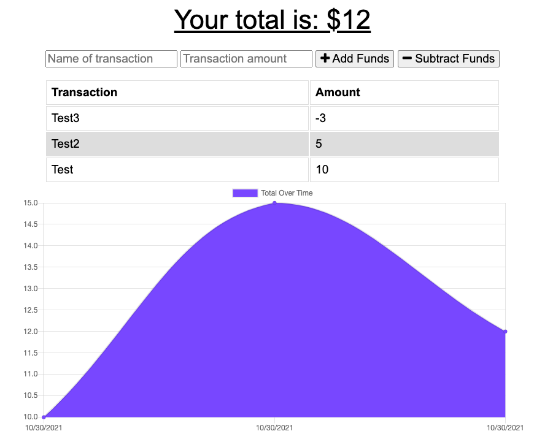

# progressive-budget
  
## Description

A simple budget tracking application that utilizes IndexedDB to allow offline access and functionality. 

Users can add expenses and deposits to their budget with or without a connection. Transactions entered when offline will be added when back online. 
   
## Table of Contents
  
  - [Links](#links)
  - [Installation](#installation)
  - [Usage](#usage)
  - [Credits](#credits)
  - [Questions](#questions)

## Links

Deployed via Heroku, can be found [here](https://stephje-progressive-budget.herokuapp.com/)
  
## Installation
  
Deployed via Heroku.
If running locally, enter 'npm i' from the command line to install required packages.
  
## Usage
  
If running locally, enter 'npm start' in the command line to initialize.

## Credits 

Project was completed as part of a University of Western Australia coding bootcamp. Starter code provided by the University of Western Australia. Content relating to service worker, web manifest, and IndexedDB was added to fulfil project requirements. 
  
## Questions
  
  For any questions pertaining to this project, the developer can be reached via any of the contact methods listed below. 
  Please ensure that you include the name of this project ("progressive-budget") in any communications. 

- [GitHub](https://github.com/stephje)
- [Email](mailto:s.jenkins3018@gmail.com)

## Screenshot of Deployed Application

  

  